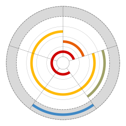
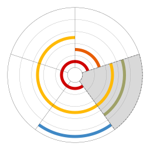

# Hoop Diagram
Visualize set intersections.
## Features
* highlight elements or set, preserves provided set order
* export diagram to resolution independent SVG file format
* minimal dependencies, built on top of Python native set type
* preview of diagram before exporting
* released under the permissive MIT License
## Installation
To install, just run:
```
pip install hoop_diagram
```
## Usage
```python
import hoop_diagram
diagram = hoop_diagram.visualize.Hoop(sets=[{1, 2}, {3, 4}, {1, 3, 5}, {1, 5}])
```
| |`diagram.highlight_element(5)` | `diagram.highlight_set({1, 2})` |
|---|---|---|
|  |  |  |
## References
* [Peter Rodgers, Peter Chapman, Andrew Blake, Martin Nöllenburg, Markus Wallinger, & Alexander Dobler. (2024). Hoop Diagrams: A Set Visualization Method.](https://arxiv.org/abs/2406.13260)